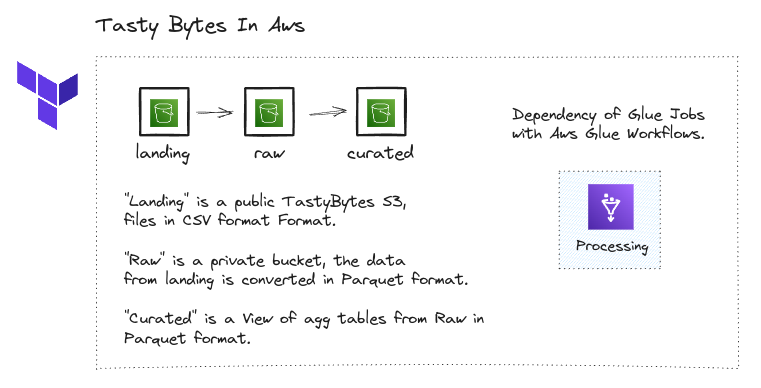

# Tasty Bytes Workflow

---

Tasty Bytes is a fictious company created by Snowflake for Snowflake 101 course, used in Intro to Snowflake course from coursera too.

Table Overview:

- order_detail, total rows: 673655465, Describe details about orders such as items.
- order_header, total rows: 248201269, Describe order main details such as total price, location, customer and truck.
- truck, total rows: 450, Describe details about trucks.
- location, total rows: 13093, Describe details about location.
- customer, total rows: 222540, Describes detail about customers.

Its a very cool dataset for study at Snowflake and for other study in general. In this repo i used Tasty Bytes dataset with AWS glue Workflow and make the same solution inside Snowflake Snowsight.

